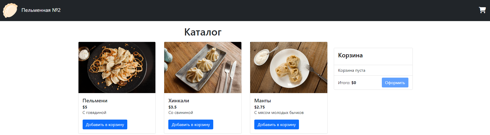

# Momo Store aka Пельменная №2

# Оглавление <!-- omit in toc -->

- [Общее](#общее)
  - [Frontend](#frontend)
  - [Backend](#backend)
  - [Локальный запуск](#локальный-запуск)
  - [Стратегии деплоя](#стратегии-деплоя)
  - [Структура репозитория приложения](#структура-репозитория-приложения)



## Frontend

```bash
npm install
NODE_ENV=production VUE_APP_API_URL=http://localhost:8081 npm run serve
```

## Backend

```bash
go run ./cmd/api
go test -v ./... 
```
# Общее

Сборка приложения выполняется сразу в контейнеры, которые затем деплоятся в кластер Kubernetes, развернутый в Яндекс.Облаке.

## Frontend

Контейнер фронтенда собирается на базе образа `node:16.13.2` и публикуется в образе `nginx:stable`

При сборке необходимо указывать следующие переменные: 

```
VERSION - версия приложения (по-умолчанию формируется в пайплайне - 1.0.${CI_PIPELINE_ID})
```
После сборки контейнер тестируется, затем маркируется тэгом `latest` и публикуется в GitLab Container Registry


Dockerfile:

```dockerfile
# Stage 1 - Build UI
FROM node:16 AS builder
# Create app directory
WORKDIR /usr/src/app
ARG MOMO_URL=${MOMO_URL}
ARG VUE_APP_API_URL=https://${MOMO_URL}/api
ARG NODE_ENV=dev
COPY ./package.json .
RUN npm install
COPY . .
RUN npm run build
RUN ls -la /usr/src/app/dist


# release stage
FROM nginx:1.23.3-alpine
WORKDIR /usr/share/nginx/html
# copy artifacts from build stage 
COPY --from=builder /usr/src/app/dist/ .
# copy config for nginx
RUN rm /etc/nginx/conf.d/default.conf
COPY --from=builder /usr/src/app/nginx.tmpl /etc/nginx/conf.d/default.conf
# set port
EXPOSE 80
```

При запуске контейнера с фронтендом необходимо передать переменную окружения MOMO_URL, которая заменяет в коде приложения заранее размещенный шаблон. Это позволяет динамически менять адрес бэкенда без повторной сборки приложения.

## Backend

Сборка контейнера на базе образа `golang:1.18-alpine3.17` и затем артифакт сборки копируется в контейнер для минимализации итогового размера контейнера.

После тестирования контейнера, он публикуется в GitLab Container Registry с тегом `latest`.

Dockerfile:

```dockerfile
##
## STEP 1 - BUILD
##

FROM golang:1.18-alpine as build

# Add a work directory
WORKDIR /app
# Cache and install dependencies
COPY go.mod go.sum ./
RUN go mod download
# Copy app files
COPY . .
# compile application
RUN go build -o /backend /app/cmd/api

##
## STEP 2 - DEPLOY
##
FROM alpine:3.15.0

# Add a work directory
WORKDIR /
# Copy built binary from builder
COPY --from=build /backend /backend
# Expose port
EXPOSE 8081
# Start app
ENTRYPOINT ["/backend"]
```
## Локальный запуск

Через docker-compose

```bash
docker-compose up
```
## Структура репозитория приложения

```
.
├── backend
├── frontend
├── docker-compose.yml
├── helm-chart.gitlab-ci.yml
├── .gitlab-ci.yml
└── README.md
```